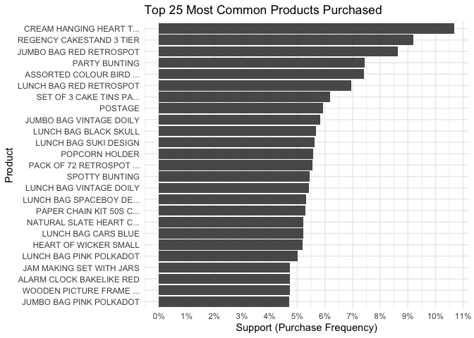
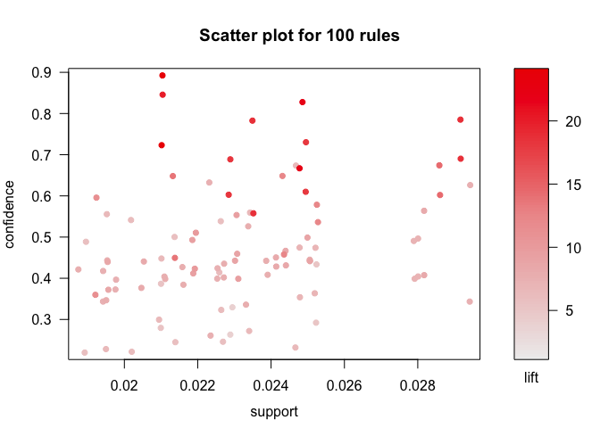
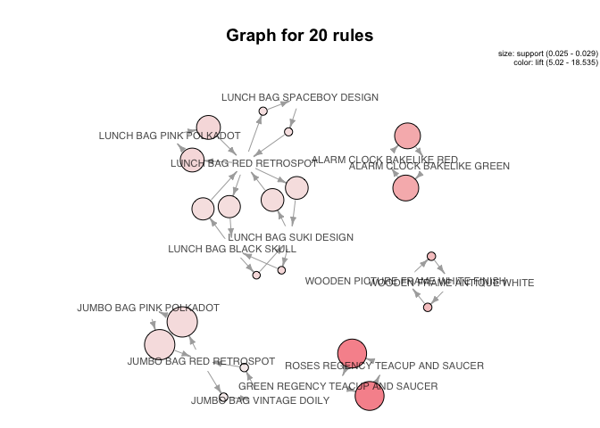
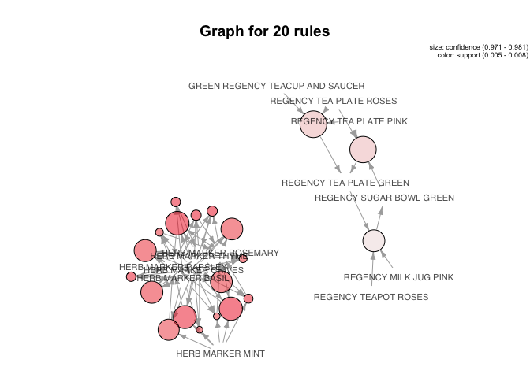

Association rules modeling | UCI retail shopping 2 dataset
================

### Notebook objective

  - Explore using association rules for e-commerce pattern/trend
    discovery.

### Association rules overview (AKA marketing basket analysis)

  - Historically, association rules models have been used to discover
    interesting patterns in retailer/shopping purchasing data.
  - However, association rules can be used in other domains like content
    streaming, social networks, etc.
  - This technique could power a similar products you might like
    feature, be used for electing upsell products in a checkout flow,
    email marketing/promotions, etc.
  - With association rules we generate rules for an item set of items.
    The item set could be one or more items. Think of an item here as a
    movie or retailer product SKU.
  - Brute force frequency calculation of all item set combinations is
    computationally expensive.
  - Model thresholds and [apriori
    principle](https://en.wikipedia.org/wiki/Apriori_algorithm) are used
    to prune back the number of association calculations required.

### Key metrics

  - Support: frequency of users to purchase an item (e.g. could be just
    product A or product A & B, etc)
  - Confidence: of users to who buy A what percent also buy B
  - Lift: how likely are users to buy B with A, while controlling for
    how popular B is (positive value more likely, negative value less
    likely).
  - Rules can we sorted/prioritized by various metrics depending on use
    case.
  - Rules can included more more than two items (i.e (A, B =\> C).
  - [Arules Package Intro
    Paper](https://cran.r-project.org/web/packages/arules/vignettes/arules.pdf)

### Packages

``` r
required_packages <- c('tidyverse', 'arules', 'arulesViz', 
                       'scales', 'readxl', 'janitor')

for(p in required_packages) {
  library(p,character.only = TRUE)
}
```

### UCI Open Dataset

  - [Data dictionary and background
    context](https://archive.ics.uci.edu/ml/datasets/Online+Retail+II)
  - [Online retail 2
    dataset](http://archive.ics.uci.edu/ml/machine-learning-databases/00502/)

<!-- end list -->

``` r
# read online retail Execl from working directory
df_2010_2011_raw <- read_excel("online_retail_II.xlsx", sheet = "Year 2010-2011")

# clean column names
df_2010_2011 <- 
  tibble::as_tibble(
    df_2010_2011_raw, 
    .name_repair = janitor::make_clean_names
  )

# filter out adjustment records, cancel records, 
df_2010_2011 <- df_2010_2011 %>%
  mutate(canceled_order = !is.na(str_extract(invoice, "^C"))) %>%
  filter(canceled_order == F & !is.na(customer_id)) %>%
  filter(!str_detect(stock_code, "ADJUST"))

### clean product descriptions of punctuation
### prevents parsing issues downstream when using ":" for data setup
df_2010_2011 <- df_2010_2011 %>%
  mutate(description = str_replace_all(description, "[:punct:]", ""),
         description = str_replace_all(description, "  ", " "))
```

### Some product codes have multiple descriptions

  - Need consistent product descriptions for arules generation.
  - \~5% of product codes have more than one description.

<!-- end list -->

``` r
### number of items with multiple descriptions
df_2010_2011 %>%
  group_by(stock_code) %>%
  summarise(unique_description_count = n_distinct(description)) %>%
  group_by(unique_description_count) %>%
  summarise(stock_code_count = n_distinct(stock_code)) %>%
  mutate(percent_total = stock_code_count/sum(stock_code_count)*100)
```

    ## # A tibble: 4 x 3
    ##   unique_description_count stock_code_count percent_total
    ##                      <int>            <int>         <dbl>
    ## 1                        1             3473       94.8   
    ## 2                        2              176        4.80  
    ## 3                        3               14        0.382 
    ## 4                        4                2        0.0546

``` r
multiple_description_codes <- df_2010_2011 %>%
  group_by(stock_code) %>%
  summarise(unique_description_count = n_distinct(description)) %>%
  filter(unique_description_count>1)
```

### Product description clean up

  - Data cleaning approach to handle cases where stock codes could have
    multiple descriptions.

<!-- end list -->

``` r
descriptions_to_use <- df_2010_2011 %>%
  filter(stock_code %in% unique(multiple_description_codes$stock_code)) %>%
  group_by(stock_code) %>%
  summarise(last_description = last(description, order_by = invoice_date)) %>%
  ungroup()

### replace product descriptions for codes with multiples
df_2010_2011 <- df_2010_2011 %>%
  left_join(descriptions_to_use) %>%
  mutate(description = ifelse(
    is.na(last_description), 
    description, 
    last_description
    )
  ) %>%
  dplyr::select(-last_description)

### check that all product codes now have one unique description
df_2010_2011 %>%
  group_by(stock_code) %>%
  summarise(unique_descriptions = n_distinct(description)) %>%
  dplyr::count(unique_descriptions)
```

    ## # A tibble: 1 x 2
    ##   unique_descriptions     n
    ##                 <int> <int>
    ## 1                   1  3665

### Typical invoice size and quanity

  - Typical invoice order contains 15 (median) stock codes.

<!-- end list -->

``` r
### invoice level summary starts
df_2010_2011 %>%
  group_by(invoice) %>%
  summarise(products_purchased = n_distinct(stock_code),
            average_quanity = mean(quantity),
            .groups = "drop") %>%
  summary()
```

    ##    invoice          products_purchased average_quanity   
    ##  Length:18536       Min.   :  1.00     Min.   :    1.00  
    ##  Class :character   1st Qu.:  6.00     1st Qu.:    5.62  
    ##  Mode  :character   Median : 15.00     Median :   10.21  
    ##                     Mean   : 20.93     Mean   :   37.04  
    ##                     3rd Qu.: 27.00     3rd Qu.:   17.50  
    ##                     Max.   :541.00     Max.   :80995.00

### Customer level summary stats

  - Median number of invoices per customer: 2.

<!-- end list -->

``` r
df_2010_2011 %>%
  group_by(cust_char = as.character(customer_id)) %>%
  summarise(number_of_invoices = n_distinct(invoice),
            products_purchased = n_distinct(stock_code),
            .groups = "drop") %>%
  summary()
```

    ##   cust_char         number_of_invoices products_purchased
    ##  Length:4339        Min.   :  1.000    Min.   :   1.00   
    ##  Class :character   1st Qu.:  1.000    1st Qu.:  16.00   
    ##  Mode  :character   Median :  2.000    Median :  35.00   
    ##                     Mean   :  4.272    Mean   :  61.49   
    ##                     3rd Qu.:  5.000    3rd Qu.:  77.00   
    ##                     Max.   :210.000    Max.   :1787.00

### Generate transaction format (one row per invoice)

  - For each invoice, we concat the products purchased by “:”.
  - This approach generates a basket format csv which is a input format
    for the arules package.

<!-- end list -->

``` r
transaction_format <- df_2010_2011 %>%
  group_by(invoice) %>%
  summarise(products_purchased = paste0(unique(description), collapse = ":")) %>%
  dplyr::select(-invoice) %>%
  ungroup()

write_csv(transaction_format, "online_retail_2_transactions.csv")
```

### Read in data using arules package format

  - Input data is in basket format with one row representing a character
    string of products included in a customers invoice.

<!-- end list -->

``` r
trans <- arules::read.transactions("online_retail_2_transactions.csv",
                           format = "basket",
                           sep = ":")
```

### Most Commons Products

  - Popular products related to party supplies and party gifts (aligns
    with data source info which states the data is from a company which
    mainly sells unique all-occasion gift-ware).

<!-- end list -->

``` r
item_freq_df <- tibble(item = names(itemFrequency(trans)),
                    item_order_frequency = itemFrequency(trans))

item_freq_df %>%
  arrange(-item_order_frequency) %>%
  head(25) %>%
  ggplot(aes(y=reorder(item, item_order_frequency),
             x=item_order_frequency)) +
  geom_col() +
  theme(axis.text.y = element_text(size=6)) +
  scale_y_discrete(label = function(x) stringr::str_trunc(x, 24)) +
  scale_x_continuous(labels = scales::percent_format(accuracy=1),
                     breaks = seq(0, 1, by=0.01)) +
  theme_minimal() +
  labs(title="Top 25 Most Common Products Purchased",
       y="Product",
       x="Support (Purchase Frequency)")
```

<!-- -->

### Most common product pairs ordered

  - Eclat algorithm to find most common item pairs, etc.

<!-- end list -->

``` r
item_pairs <- eclat(trans, parameter = list(support=0.005, minlen=2, maxlen=2))
```

    ## Eclat
    ## 
    ## parameter specification:
    ##  tidLists support minlen maxlen            target  ext
    ##     FALSE   0.005      2      2 frequent itemsets TRUE
    ## 
    ## algorithmic control:
    ##  sparse sort verbose
    ##       7   -2    TRUE
    ## 
    ## Absolute minimum support count: 92 
    ## 
    ## create itemset ... 
    ## set transactions ...[3637 item(s), 18537 transaction(s)] done [0.20s].
    ## sorting and recoding items ... [1245 item(s)] done [0.01s].
    ## creating sparse bit matrix ... [1245 row(s), 18537 column(s)] done [0.01s].
    ## writing  ... [1858 set(s)] done [1.68s].
    ## Creating S4 object  ... done [0.00s].

``` r
sort(item_pairs, by = 'support') %>% 
  as("data.frame") %>%
  head(10) %>%
  dplyr::select(-transIdenticalToItemsets)
```

    ##                                                                  items
    ## 1375                 {JUMBO BAG PINK POLKADOT,JUMBO BAG RED RETROSPOT}
    ## 1231 {GREEN REGENCY TEACUP AND SAUCER,ROSES REGENCY TEACUP AND SAUCER}
    ## 1476             {ALARM CLOCK BAKELIKE GREEN,ALARM CLOCK BAKELIKE RED}
    ## 1760                 {LUNCH BAG PINK POLKADOT,LUNCH BAG RED RETROSPOT}
    ## 1846                   {LUNCH BAG RED RETROSPOT,LUNCH BAG SUKI DESIGN}
    ## 1808                   {LUNCH BAG BLACK SKULL,LUNCH BAG RED RETROSPOT}
    ## 1346    {WOODEN FRAME ANTIQUE WHITE,WOODEN PICTURE FRAME WHITE FINISH}
    ## 1722                 {JUMBO BAG RED RETROSPOT,JUMBO BAG VINTAGE DOILY}
    ## 1840               {LUNCH BAG RED RETROSPOT,LUNCH BAG SPACEBOY DESIGN}
    ## 1811                     {LUNCH BAG BLACK SKULL,LUNCH BAG SUKI DESIGN}
    ##         support count
    ## 1375 0.02945460   546
    ## 1231 0.02918487   541
    ## 1476 0.02859147   530
    ## 1760 0.02821384   523
    ## 1846 0.02799806   519
    ## 1808 0.02789017   517
    ## 1346 0.02524680   468
    ## 1722 0.02524680   468
    ## 1840 0.02519286   467
    ## 1811 0.02508497   465

##### Exclude item pairs that contain BAG or BOX

``` r
sort(item_pairs, by = 'support') %>%
  as("data.frame") %>%
  filter(!str_detect(items, "BAG | BOX")) %>%
  head(10) %>%
  dplyr::select(-transIdenticalToItemsets)
```

    ##                                                                   items
    ## 1     {GREEN REGENCY TEACUP AND SAUCER,ROSES REGENCY TEACUP AND SAUCER}
    ## 2                 {ALARM CLOCK BAKELIKE GREEN,ALARM CLOCK BAKELIKE RED}
    ## 3        {WOODEN FRAME ANTIQUE WHITE,WOODEN PICTURE FRAME WHITE FINISH}
    ## 4  {GARDENERS KNEELING PAD CUP OF TEA,GARDENERS KNEELING PAD KEEP CALM}
    ## 5      {GREEN REGENCY TEACUP AND SAUCER,PINK REGENCY TEACUP AND SAUCER}
    ## 6   {CREAM HANGING HEART TLIGHT HOLDER,RED HANGING HEART TLIGHT HOLDER}
    ## 7     {PAPER CHAIN KIT 50S CHRISTMAS,PAPER CHAIN KIT VINTAGE CHRISTMAS}
    ## 8      {PINK REGENCY TEACUP AND SAUCER,ROSES REGENCY TEACUP AND SAUCER}
    ## 9            {REGENCY CAKESTAND 3 TIER,ROSES REGENCY TEACUP AND SAUCER}
    ## 10                        {HEART OF WICKER LARGE,HEART OF WICKER SMALL}
    ##       support count
    ## 1  0.02918487   541
    ## 2  0.02859147   530
    ## 3  0.02524680   468
    ## 4  0.02497707   463
    ## 5  0.02481523   460
    ## 6  0.02465340   457
    ## 7  0.02432972   451
    ## 8  0.02352053   436
    ## 9  0.02265739   420
    ## 10 0.02195609   407

### Most Commons Product Trios Ordered

``` r
item_trios <- eclat(trans, parameter = list(support=0.005, minlen=3, maxlen=3))
```

    ## Eclat
    ## 
    ## parameter specification:
    ##  tidLists support minlen maxlen            target  ext
    ##     FALSE   0.005      3      3 frequent itemsets TRUE
    ## 
    ## algorithmic control:
    ##  sparse sort verbose
    ##       7   -2    TRUE
    ## 
    ## Absolute minimum support count: 92 
    ## 
    ## create itemset ... 
    ## set transactions ...[3637 item(s), 18537 transaction(s)] done [0.18s].
    ## sorting and recoding items ... [1245 item(s)] done [0.01s].
    ## creating sparse bit matrix ... [1245 row(s), 18537 column(s)] done [0.01s].
    ## writing  ... [941 set(s)] done [1.66s].
    ## Creating S4 object  ... done [0.00s].

``` r
sort(item_trios, by = 'support') %>%
  as("data.frame") %>%
  head(10) %>%
  dplyr::select(-transIdenticalToItemsets)
```

    ##                                                                                                items
    ## 264 {GREEN REGENCY TEACUP AND SAUCER,PINK REGENCY TEACUP AND SAUCER,ROSES REGENCY TEACUP AND SAUCER}
    ## 531       {GREEN REGENCY TEACUP AND SAUCER,REGENCY CAKESTAND 3 TIER,ROSES REGENCY TEACUP AND SAUCER}
    ## 888                          {LUNCH BAG BLACK SKULL,LUNCH BAG PINK POLKADOT,LUNCH BAG RED RETROSPOT}
    ## 897                          {LUNCH BAG PINK POLKADOT,LUNCH BAG RED RETROSPOT,LUNCH BAG SUKI DESIGN}
    ## 931                            {LUNCH BAG BLACK SKULL,LUNCH BAG RED RETROSPOT,LUNCH BAG SUKI DESIGN}
    ## 882                            {LUNCH BAG CARS BLUE,LUNCH BAG PINK POLKADOT,LUNCH BAG RED RETROSPOT}
    ## 922                              {LUNCH BAG CARS BLUE,LUNCH BAG RED RETROSPOT,LUNCH BAG SUKI DESIGN}
    ## 263        {GREEN REGENCY TEACUP AND SAUCER,PINK REGENCY TEACUP AND SAUCER,REGENCY CAKESTAND 3 TIER}
    ## 936                        {LUNCH BAG RED RETROSPOT,LUNCH BAG SPACEBOY DESIGN,LUNCH BAG SUKI DESIGN}
    ## 530                  {ALARM CLOCK BAKELIKE GREEN,ALARM CLOCK BAKELIKE PINK,ALARM CLOCK BAKELIKE RED}
    ##        support count
    ## 264 0.02103900   390
    ## 531 0.01683120   312
    ## 888 0.01661542   308
    ## 897 0.01510493   280
    ## 931 0.01510493   280
    ## 882 0.01505098   279
    ## 922 0.01488914   276
    ## 263 0.01461941   271
    ## 936 0.01461941   271
    ## 530 0.01440363   267

### Apriori algorithm

  - Eclat generates metrics per itemset `{A, B}`.
  - Apriori algo generates metrics comparing itemsets and outputs rules
    `{A => B}`.

<!-- end list -->

``` r
retail_rules <- apriori(trans, 
                        parameter = list(
                          support=0.005,
                          confidence=0.005,
                          minlen=2,
                          maxlen=4
                          )
                        )
```

    ## Apriori
    ## 
    ## Parameter specification:
    ##  confidence minval smax arem  aval originalSupport maxtime support minlen
    ##       0.005    0.1    1 none FALSE            TRUE       5   0.005      2
    ##  maxlen target  ext
    ##       4  rules TRUE
    ## 
    ## Algorithmic control:
    ##  filter tree heap memopt load sort verbose
    ##     0.1 TRUE TRUE  FALSE TRUE    2    TRUE
    ## 
    ## Absolute minimum support count: 92 
    ## 
    ## set item appearances ...[0 item(s)] done [0.00s].
    ## set transactions ...[3637 item(s), 18537 transaction(s)] done [0.18s].
    ## sorting and recoding items ... [1245 item(s)] done [0.01s].
    ## creating transaction tree ... done [0.01s].
    ## checking subsets of size 1 2 3 4 done [0.07s].
    ## writing ... [7959 rule(s)] done [0.01s].
    ## creating S4 object  ... done [0.01s].

``` r
summary(retail_rules)
```

    ## set of 7959 rules
    ## 
    ## rule length distribution (lhs + rhs):sizes
    ##    2    3    4 
    ## 3716 2823 1420 
    ## 
    ##    Min. 1st Qu.  Median    Mean 3rd Qu.    Max. 
    ##   2.000   2.000   3.000   2.712   3.000   4.000 
    ## 
    ## summary of quality measures:
    ##     support           confidence         coverage             lift         
    ##  Min.   :0.005017   Min.   :0.04752   Min.   :0.005125   Min.   :  0.9943  
    ##  1st Qu.:0.005503   1st Qu.:0.22407   1st Qu.:0.010466   1st Qu.:  5.7046  
    ##  Median :0.006312   Median :0.43243   Median :0.017047   Median : 10.2601  
    ##  Mean   :0.007276   Mean   :0.43399   Mean   :0.025094   Mean   : 14.8529  
    ##  3rd Qu.:0.007930   3rd Qu.:0.61754   3rd Qu.:0.033231   3rd Qu.: 14.9661  
    ##  Max.   :0.029455   Max.   :0.98131   Max.   :0.106706   Max.   :127.4842  
    ##      count      
    ##  Min.   : 93.0  
    ##  1st Qu.:102.0  
    ##  Median :117.0  
    ##  Mean   :134.9  
    ##  3rd Qu.:147.0  
    ##  Max.   :546.0  
    ## 
    ## mining info:
    ##   data ntransactions support confidence
    ##  trans         18537   0.005      0.005

##### Top 10 rules by support

``` r
retail_rules %>% 
  as("data.frame") %>%
  arrange(-support) %>%
  head(10)
```

    ##                                                                     rules
    ## 1                  {JUMBO BAG PINK POLKADOT} => {JUMBO BAG RED RETROSPOT}
    ## 2                  {JUMBO BAG RED RETROSPOT} => {JUMBO BAG PINK POLKADOT}
    ## 3  {GREEN REGENCY TEACUP AND SAUCER} => {ROSES REGENCY TEACUP AND SAUCER}
    ## 4  {ROSES REGENCY TEACUP AND SAUCER} => {GREEN REGENCY TEACUP AND SAUCER}
    ## 5              {ALARM CLOCK BAKELIKE GREEN} => {ALARM CLOCK BAKELIKE RED}
    ## 6              {ALARM CLOCK BAKELIKE RED} => {ALARM CLOCK BAKELIKE GREEN}
    ## 7                  {LUNCH BAG PINK POLKADOT} => {LUNCH BAG RED RETROSPOT}
    ## 8                  {LUNCH BAG RED RETROSPOT} => {LUNCH BAG PINK POLKADOT}
    ## 9                    {LUNCH BAG SUKI DESIGN} => {LUNCH BAG RED RETROSPOT}
    ## 10                   {LUNCH BAG RED RETROSPOT} => {LUNCH BAG SUKI DESIGN}
    ##       support confidence   coverage      lift count
    ## 1  0.02945460  0.6268657 0.04698711  7.262631   546
    ## 2  0.02945460  0.3412500 0.08631386  7.262631   546
    ## 3  0.02918487  0.7829233 0.03727680 18.535184   541
    ## 4  0.02918487  0.6909323 0.04223984 18.535184   541
    ## 5  0.02859147  0.6717364 0.04256352 14.198378   530
    ## 6  0.02859147  0.6043330 0.04731078 14.198378   530
    ## 7  0.02821384  0.5617615 0.05022388  8.078645   523
    ## 8  0.02821384  0.4057409 0.06953660  8.078645   523
    ## 9  0.02799806  0.4976031 0.05626585  7.155988   519
    ## 10 0.02799806  0.4026377 0.06953660  7.155988   519

##### Top 10 rules by confidence

``` r
retail_rules %>% 
  as("data.frame") %>%
  arrange(-confidence) %>%
  head(10)
```

    ##                                                                                                            rules
    ## 1  {GREEN REGENCY TEACUP AND SAUCER,REGENCY TEA PLATE PINK,REGENCY TEA PLATE ROSES} => {REGENCY TEA PLATE GREEN}
    ## 2         {REGENCY SUGAR BOWL GREEN,REGENCY TEA PLATE PINK,REGENCY TEA PLATE ROSES} => {REGENCY TEA PLATE GREEN}
    ## 3                           {HERB MARKER CHIVES,HERB MARKER ROSEMARY,HERB MARKER THYME} => {HERB MARKER PARSLEY}
    ## 4                            {HERB MARKER CHIVES,HERB MARKER MINT,HERB MARKER ROSEMARY} => {HERB MARKER PARSLEY}
    ## 5                               {HERB MARKER CHIVES,HERB MARKER MINT,HERB MARKER THYME} => {HERB MARKER PARSLEY}
    ## 6                              {HERB MARKER BASIL,HERB MARKER CHIVES,HERB MARKER THYME} => {HERB MARKER PARSLEY}
    ## 7                              {HERB MARKER BASIL,HERB MARKER CHIVES,HERB MARKER PARSLEY} => {HERB MARKER THYME}
    ## 8             {REGENCY MILK JUG PINK,REGENCY TEA PLATE GREEN,REGENCY TEAPOT ROSES} => {REGENCY SUGAR BOWL GREEN}
    ## 9                             {HERB MARKER BASIL,HERB MARKER CHIVES,HERB MARKER ROSEMARY} => {HERB MARKER THYME}
    ## 10                          {HERB MARKER BASIL,HERB MARKER CHIVES,HERB MARKER ROSEMARY} => {HERB MARKER PARSLEY}
    ##        support confidence    coverage     lift count
    ## 1  0.005664347  0.9813084 0.005772239 67.37227   105
    ## 2  0.005610401  0.9811321 0.005718293 67.36017   104
    ## 3  0.007822193  0.9797297 0.007984032 97.11898   145
    ## 4  0.007768247  0.9795918 0.007930086 97.10531   144
    ## 5  0.007714301  0.9794521 0.007876140 97.09146   143
    ## 6  0.007552463  0.9790210 0.007714301 97.04873   140
    ## 7  0.007552463  0.9790210 0.007714301 97.57049   140
    ## 8  0.005016993  0.9789474 0.005124885 67.71174    93
    ## 9  0.007498516  0.9788732 0.007660355 97.55577   139
    ## 10 0.007498516  0.9788732 0.007660355 97.03408   139

##### Top 10 rules by lift

``` r
retail_rules %>% 
  as("data.frame") %>%
  arrange(-lift) %>%
  head(10)
```

    ##                                                                                rules
    ## 1  {DOLLY GIRL CHILDRENS CUP,SPACEBOY CHILDRENS BOWL} => {DOLLY GIRL CHILDRENS BOWL}
    ## 2   {DOLLY GIRL CHILDRENS BOWL,SPACEBOY CHILDRENS CUP} => {DOLLY GIRL CHILDRENS CUP}
    ## 3   {DOLLY GIRL CHILDRENS CUP,SPACEBOY CHILDRENS CUP} => {DOLLY GIRL CHILDRENS BOWL}
    ## 4                          {DOLLY GIRL CHILDRENS BOWL} => {DOLLY GIRL CHILDRENS CUP}
    ## 5                          {DOLLY GIRL CHILDRENS CUP} => {DOLLY GIRL CHILDRENS BOWL}
    ## 6  {DOLLY GIRL CHILDRENS BOWL,SPACEBOY CHILDRENS BOWL} => {DOLLY GIRL CHILDRENS CUP}
    ## 7    {DOLLY GIRL CHILDRENS BOWL,SPACEBOY CHILDRENS CUP} => {SPACEBOY CHILDRENS BOWL}
    ## 8                                           {SPACEBOY BEAKER} => {DOLLY GIRL BEAKER}
    ## 9                                           {DOLLY GIRL BEAKER} => {SPACEBOY BEAKER}
    ## 10  {HERB MARKER MINT,HERB MARKER PARSLEY,HERB MARKER THYME} => {HERB MARKER CHIVES}
    ##        support confidence    coverage     lift count
    ## 1  0.005178832  0.9696970 0.005340670 127.4842    96
    ## 2  0.005016993  0.9587629 0.005232778 123.4207    93
    ## 3  0.005016993  0.8532110 0.005880132 112.1700    93
    ## 4  0.006311701  0.8297872 0.007606409 106.8178   117
    ## 5  0.006311701  0.8125000 0.007768247 106.8178   117
    ## 6  0.005178832  0.8135593 0.006365647 104.7288    96
    ## 7  0.005016993  0.9587629 0.005232778 102.1413    93
    ## 8  0.005394616  0.7246377 0.007444570 100.9971   100
    ## 9  0.005394616  0.7518797 0.007174840 100.9971   100
    ## 10 0.007714301  0.8993711 0.008577440 100.4316   143

### Visualizing rules

  - Plot function part of the arulesViz package is used to visualize
    rules. [Documentation on customization
    options](https://rdrr.io/cran/arulesViz/man/plot.html)
  - Visualizations and rule metrics to focus on likely to be informed by
    business objective.

##### Scatter plot of rule support, confidence, lift metrics

  - Top 100 rules ranked by support.

<!-- end list -->

``` r
plot(sort(retail_rules, by="support")[1:100])
```

<!-- -->

##### Network graph of rules

Top 20 rules ranked by support.

``` r
plot(sort(retail_rules, by="support")[1:20], 
     method="graph", 
     cex=0.7)
```

<!-- -->

Top 20 rules ranked by confidence. Adjust plot params.

``` r
plot(sort(retail_rules, by="confidence")[1:20], 
     method="graph", 
     measure="confidence",
     shading = "support",
     cex=0.7)
```

<!-- -->

### Ideas for applying these techniques in an actionable business setting

  - Marketing teams could build packages/promos for common products
    customers buy together (using above data).
  - Have a UX flow that makes it easy to buy variations of parent SKU
    (i.e. a few clicks to buy 200 lunch boxes with 10 different color
    patterns). Arules data can suggest product areas to focus on first.
  - Additional product meta data could be used to explore purchasing
    trends at the category or sub category level.
  - Segment data by customer type and purchase frequency (i.e. geo,
    wholesalers, SMBs, individual customers).
  - Recommendation features that leverage arules package rules to
    suggest products a customer might also like.
  - Interactive data visualizations could be used to empower internal
    stakeholders to explore arules trends via self-service tools.
